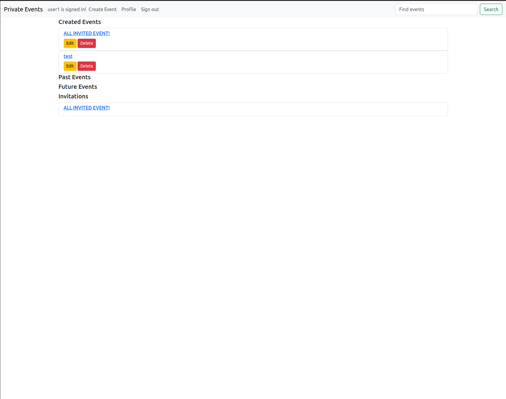

# Project: Private Events

This project is meant to deep dive into ActiveRecord association. Building a simplified version of sites like Eventbrite.
[link to lesson](https://www.theodinproject.com/lessons/ruby-on-rails-private-events)

## Table of Contents

- [Installation](#installation)
- [Features](#features)
- [Usage](#usage)

## Features

- Ability to sign up and log in
- User can create/edit events to then invite users
- If a user is not invited to an event, they can not view it
- If invited, a user can choose to attend the event or cancel
- Bootstrap used for basic styling

## Installation

<details>
  <summary>Click me</summary>

- clone repository:
```
git clone https://github.com/MclPio/private-events.git
```

- install gems:
```
bundle install
```

- migrate data
```
rails db:migrate
```

- optional: seed data to populate a bunch of users, events and invitations
```
rails db:seed
```

- start server
```
rails s
```

- open in browser
```
localhost:3000
```
</details>


## Usage

<details>
  <summary>Click me</summary>

- After running
```
rails db:seed
```
You can log in to seeded user accounts.
- email: user1@world.co
- password: 123456

- You can create an account by clicking sign-up, no need to use personal info

- The navbar should populate with options, Create Event, Profile, Sign out
To create an event:
1. Click create event at the top of navbar

2. Fill out event details and submit
3. You will then be able to invite users to the event


To edit an event:
1. Go to profile

2. Click on the edit button beside the event
3. Submit the form

To delete an event:
1. Go to profile
2. Click on delete button and click ok on the confirmation

To join an event:
1. Make sure you are invited by checking the Profile section of the navbar
2. If you are not invited you will get a message "You are not invited to this event"

2. Click on the event and click on the Attend button

To cancel an event:
1. You can either cancel on the Profile section or the event page itself
</details>